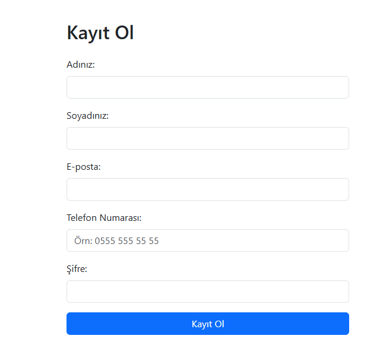
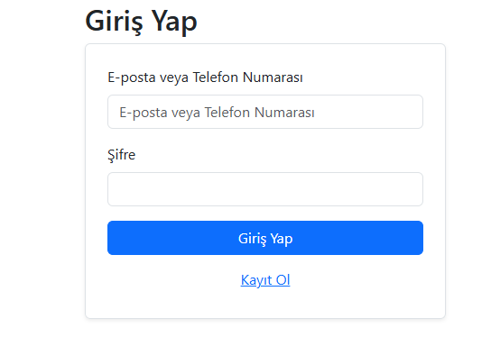
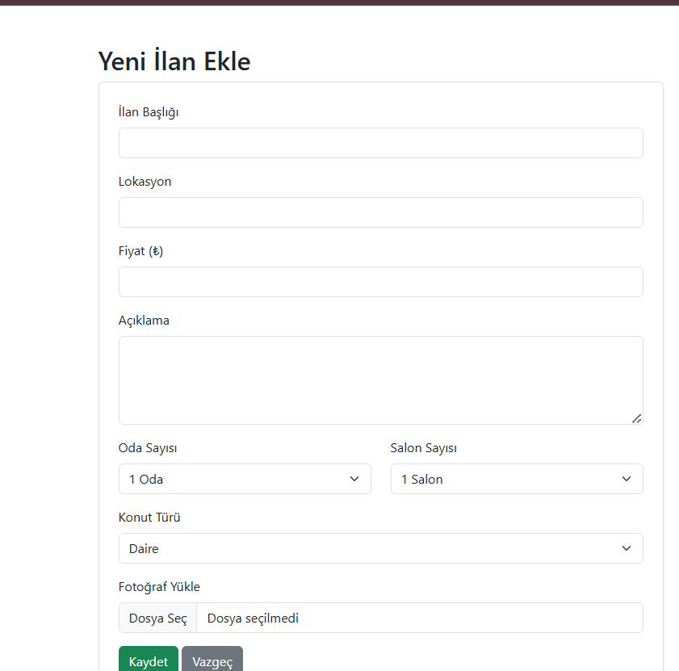
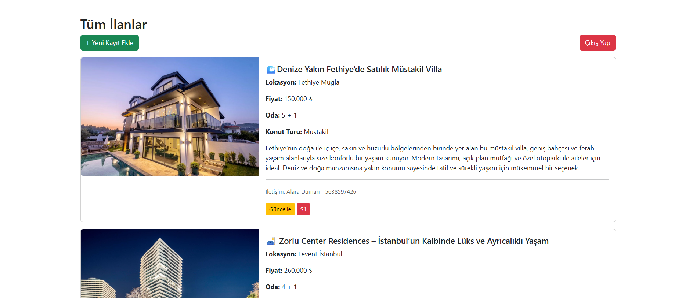
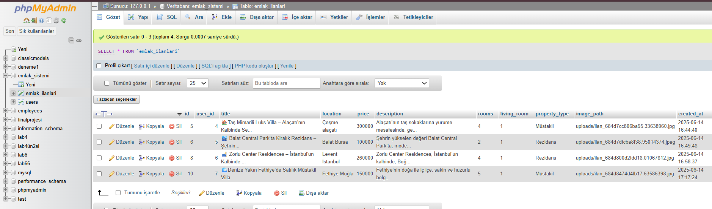
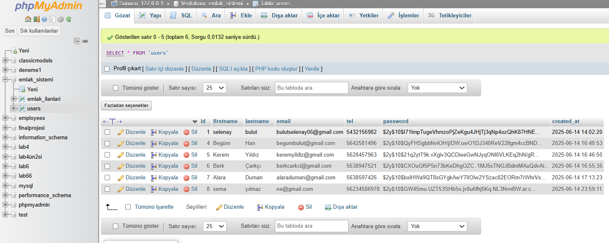

#  Gayrimenkul Kiralama ve Yönetim Sistemi

## 🔍 Proje Tanımı

Bu proje, PHP ve MySQL kullanılarak geliştirilen, gayrimenkul ilanlarının eklendiği ve yönetildiği **web tabanlı bir ilan sistemi**dir.  
Kullanıcılar kayıt olup giriş yaptıktan sonra ilan ekleyebilir, başkalarının ilanlarını görebilir, kendi ilanlarını güncelleyip silebilirler.

İlanlar; başlık, açıklama, konum, oda sayısı, fiyat, konut tipi ve fotoğraf içerebilir.  
İlan sahibinin **isim, soyisim ve telefon bilgileri** de her ilanın altında iletişim bilgisi olarak gösterilir.

---

## 🚀 Özellikler

- ✅ Kullanıcı kayıt (isim, soyisim, e-posta, telefon, şifre)
- ✅ Giriş / Çıkış sistemi
- ✅ İlan ekleme (başlık, açıklama, oda sayısı, konum, fiyat, konut tipi, fotoğraf)
- ✅ Tüm ilanların listelenmesi
- ✅ Sadece kendi ilanlarını düzenleme ve silme
- ✅ Her ilana ait fotoğraf yükleme ve görüntüleme
- ✅ Bootstrap 5 ile responsive (mobil uyumlu) tasarım

---

## 🛠 Kullanılan Teknolojiler

  
| PHP            
| MySQL          
| HTML5 + CSS3   
| Bootstrap 5    
| Apache (XAMPP) |


## Ekran Görüntüleri

**1. Kayıt Olma Ekranı**  
  

**2.Giris Yapma Ekranı**  
 

**3.İlan Ekleme Ekranı**  
 

**4. İlanlar Listesi **  
  

---

## 🚀 Kurulum ve Çalıştırma

1. `XAMPP` kurun ve `Apache + MySQL` servislerini başlatın.
2. `webdersiprojesi/` klasörünü `htdocs/` dizinine taşıyın:
    ```
    C:\xampp\htdocs\webdersiprojesi\
    ```
3. phpMyAdmin üzerinden `emlak_sistemi` adında bir veritabanı oluşturun.
4. Aşağıdaki SQL sorgusunu çalıştırarak gerekli tabloları oluşturun:

### `users` tablosu:
```sql
CREATE TABLE users (
    id INT PRIMARY KEY AUTO_INCREMENT,
    firstname VARCHAR(50),
    lastname VARCHAR(50),
    tel VARCHAR(20),
    email VARCHAR(100) UNIQUE,
    password VARCHAR(255),
    created_at TIMESTAMP DEFAULT CURRENT_TIMESTAMP
)ENGINE=InnoDB DEFAULT CHARSET=utf8mb4;
```
### `emlak_ilanlari` tablosu:

```sql
CREATE TABLE emlak_ilanlari (
    id INT AUTO_INCREMENT PRIMARY KEY,
    user_id INT NOT NULL,
    title VARCHAR(255) NOT NULL,
    location VARCHAR(255) NOT NULL,
    price INT NOT NULL,
    description TEXT,
    rooms VARCHAR(10),
    living_room VARCHAR(10),
    property_type VARCHAR(50),
    image_path VARCHAR(255),
    created_at TIMESTAMP DEFAULT CURRENT_TIMESTAMP,
    FOREIGN KEY (user_id) REFERENCES users(id) ON DELETE CASCADE
) ENGINE=InnoDB DEFAULT CHARSET=utf8mb4;

```
5. webdersiprojesi/db.php içindeki veritabanı bağlantı bilgilerini kendi MySQL ayarlarınıza göre güncelleyin.
6. Tarayıcıda yanda verilen adrese giderek uygulamayı çalıştırın: http://localhost/webdersiprojesi/login.php

**Eklenen ilanların bilgilerinin saklandığı veri tabanı ekranı**  
  

**Kayıtlı olan kullanıcıların bilgilerinin saklandığı veri tabanı ekranı**  
 

## Video Tanıtım

Projeyi detaylı anlatan kısa video:  
[Video Linki](https://youtu.be/uHeEUVle7oI)  

---


## İletişim

Proje sahibi: Selenay Bulut
E-posta: [bulutselenay06@gmail.com.com]  


